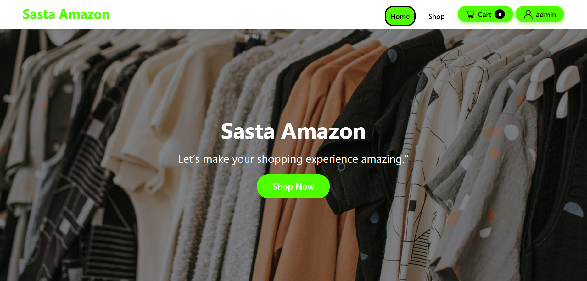
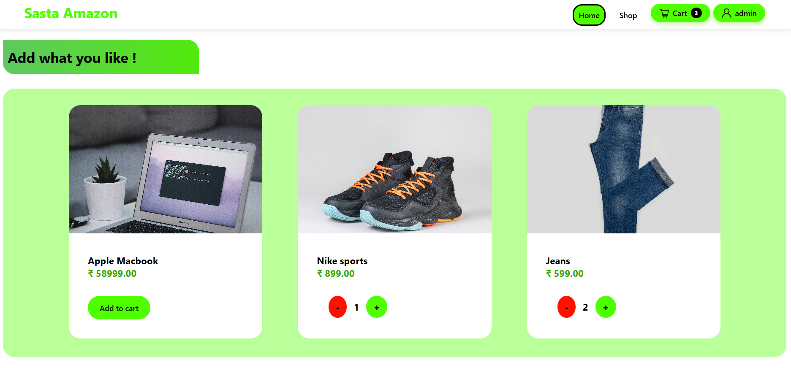
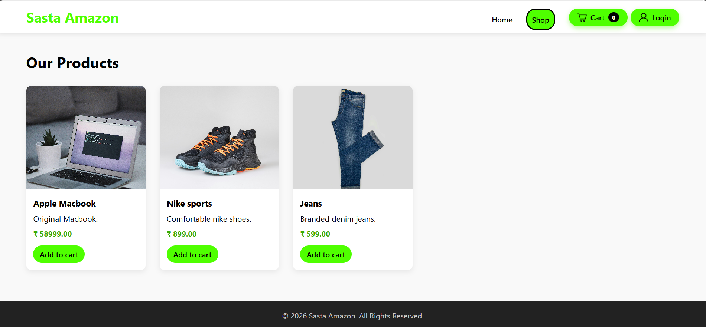
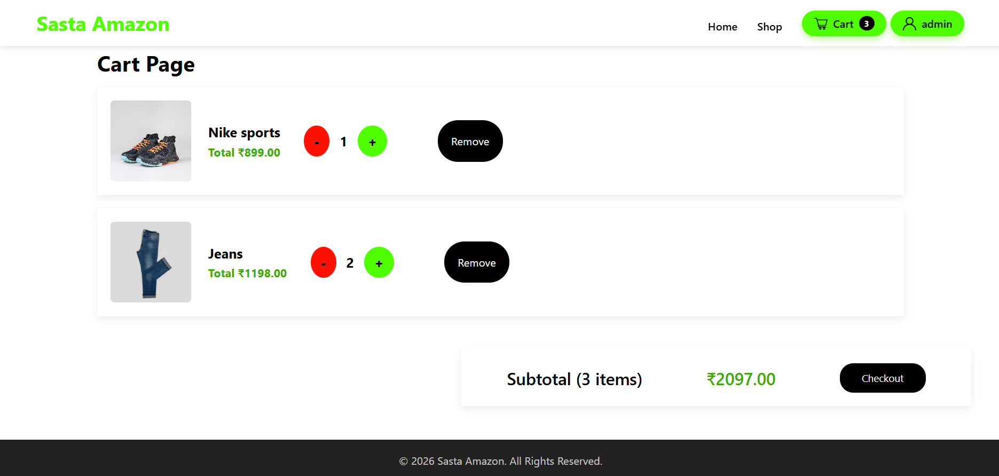
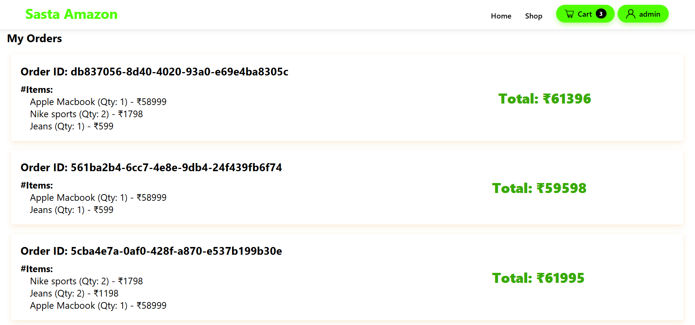
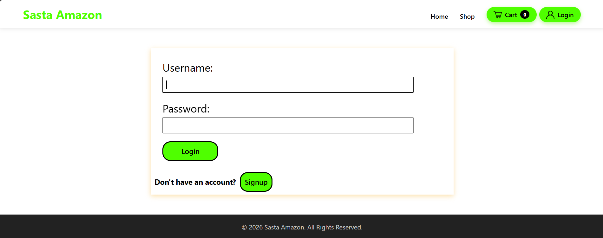

# 🛒 Sasta Amazon

[]()
[]()
[]()

**Sasta Amazon** is a Django-based mini e-commerce web application that replicates core online shopping functionalities such as product browsing, cart management, authentication, and order placement.

It supports both:
- 🧑‍💻 Guest carts using sessions  
- 🔐 Persistent carts for logged-in users  

---

## 🚀 Project Overview

This project is designed as a **full-stack Django application** with modular architecture.

It demonstrates:
- Real-world e-commerce workflow
- Session handling vs database persistence
- Clean separation of Django apps

---

## ✨ Features

- 🛍️ Browse products from home and shop pages  
- ➕ Add, increase, decrease, and remove cart items  
- 👤 Guest cart using sessions  
- 🔄 Persistent cart for authenticated users  
- 🔐 User authentication (Register / Login / Logout)  
- 📦 Place orders from cart  
- 📜 View order history  
- ⚙️ Django admin panel for product & category management  

---

## 🖼️ Screenshots


### 🏠 Home Page


### 🛒 Shop Page


### 🛒 Cart Page


### 📂 Order Profile

### 👤 Login Profile


---

## 🧱 Tech Stack

- **Backend:** Django 6  
- **Language:** Python  
- **Database:** SQLite  
- **Frontend:** HTML, CSS  
- **Auth:** Django Authentication System  

---

## 📂 App Structure

- `core` → Base layout, homepage, shared logic  
- `products` → Product & category models  
- `shop` → Product listing page  
- `cart` → Session & database cart logic  
- `order` → Order creation & history  
- `accounts` → Authentication & user profile  

---

## 🔄 User Flow

1. Users browse products  
2. Guests add items to session cart  
3. Users register or log in  
4. Cart persists for logged-in users  
5. Users place orders  
6. Users view order history  

---

## 🛒 Cart System Explained

**Two cart mechanisms are implemented:**

- **SessionCart (Guest Users):**  
  Stores product data in session  

- **Database Cart (Logged-in Users):**  
  Uses `Cart` and `CartItem` models  

---

## ⚙️ Local Setup

### 1. Clone repository
```bash
git clone https://github.com/Suyash-coder-kumar/Sasta_Amazon.git
```

### 2. Setup virtual environment
```bash
python -m venv venv
venv\Scripts\activate
```

### 3. Install dependencies
```bash
pip install -r requirements.txt
```

### 4. Navigate to project
```bash
cd sasta_amazon
```

### 5. Run migrations
```bash
python manage.py makemigrations
python manage.py migrate
```

### 6. Create admin user
```bash
python manage.py createsuperuser
```

### 7. Run server
```bash
python manage.py runserver
```

Visit:
- http://127.0.0.1:8000/
- http://127.0.0.1:8000/admin/

---

## ⚠️ Development Notes

- DEBUG mode is enabled  
- Secret key is hardcoded (not production-safe)  
- SQLite database in use  
- Media files served via Django  

---

## 📌 Future Improvements

- 💳 Payment gateway integration  
- 📱 Fully responsive UI  
- 🔍 Product search & filters  
- 🧾 Order status tracking  
- ☁️ Deployment (AWS / Docker / Render)  

---

## 💼 Portfolio Description

**Sasta Amazon** is a Django-based e-commerce web application built to demonstrate real-world backend and full-stack development concepts.

The project implements:
- Session-based and database-backed cart systems
- User authentication and authorization
- Order management workflow
- Modular Django architecture

It showcases strong understanding of:
- Django models, views, templates
- Session management
- Database relationships
- Scalable project structuring

---

## 📄 License

This project is open-source and available for learning and modification.

---

## 🙌 Author

**Suyash Kumar**  
GitHub: https://github.com/Suyash-coder-kumar